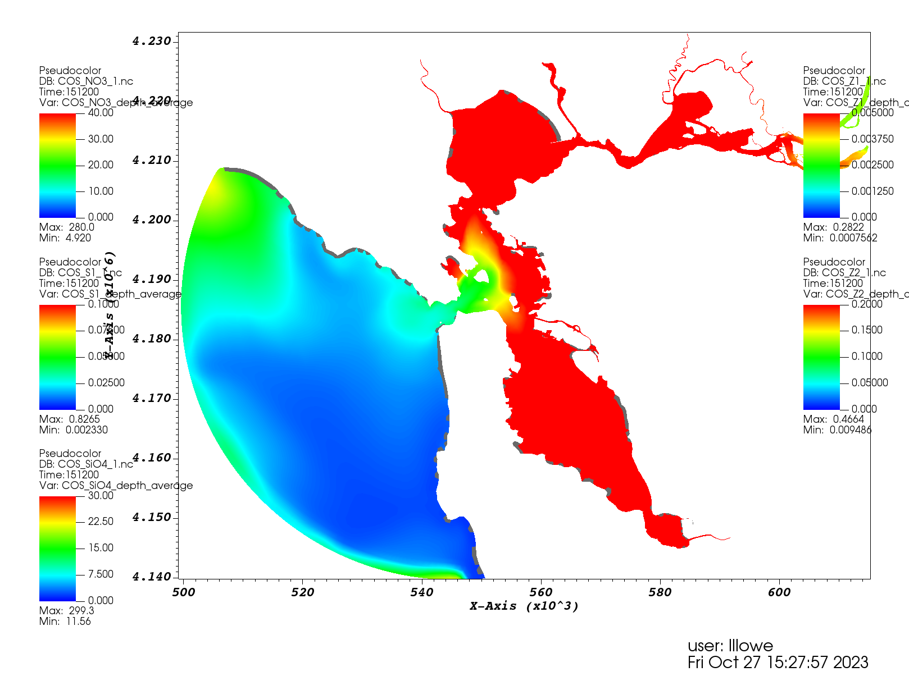

First, I synched my schism fork with newest schism, then checked if cgem-box still worked the same.

# Compiling schism-cosine

Set the environment.  Clone **my** repo, since CGEM is there, and I also have the Cmake file for cosine.  
For the first compilation, you need to build makefiles with `CMAKE`.  After that, just `make`.  Actually, I guess you won't change the cosine code, so 
probably never have to care about that again.

## Environment
Set the environment
```
module load cpu/0.15.4
module load intel/19.1.1.217
module load intel-mpi/2019.8.254
module load netcdf-c/4.7.4
module load netcdf-fortran/4.5.3
module load cmake
```

## First compilation
Get my forked schism repo:
```
git clone https://github.com/oybcst/schism.git
```

Make a build directory, cmake, then make. 
```
cd ~/schism
mkdir build_cosine
cd build_cosine
cmake -C ../cmake/SCHISM.cosine.build -C ../cmake/SCHISM.local.comet ../src/
make
```

## Further compilations
After modifying, to recompile, set the environment, then:
```
cd ~/schism/build
make
```

## Get the box model
I copied my cgem-box to cosine-box and cleaned out cgem related files.

Then, get sample cosine.nml file from the repo:
```
cp ~/schism/sample_inputs/cosine.nml .
```

Modify param.nml to include cosine related stuff.  I cleaned my param.nml of non-GEN parameters.  Here, I looked at param.in from schism_verification_tests, COSINE, SF Bay.  The only thing was `iof_cos`.

Created init_cos.nml for initial values.  Get initial values from SFBay...they are all zero! SFBay uses hotstart I think.  I opened each of the variables from SFBay, plotted depth average, and tried to pick a middle ground point.  (Image below.) 

Modify write_initial_conditions_cosine.py. Submit job, since environment gets messed up otherwise:
```
sbatch submit.python.sh
```

Check:
```
rm *.bak
head -3 COS*
```

Get executable.
```
cp ~/schism/build_cosine/bin/pschism_COSINE_TVD-VL .
```

Tried to run, but things were missing in param.nml. I copied the one from SFBay, and figure out what to turn off so it wouldn't look for non-box stuff.  

Moving output files to local computer.  Better to remove individual files, so I have rm.sh, then `source rm.sh`. to remove junk from outputs.


Initial value look sketchy?  Got it from their plots...


