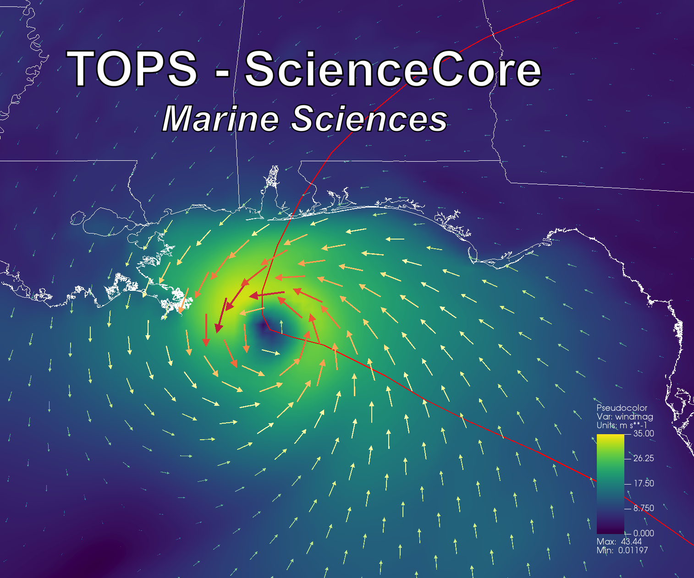

# QDM video

About the ERA and QDM data visualization

## Why am I doing this?
I'm out of time for OyBcSt, but I am working on a NASA project, replicating Brian's paper about Hurricane Sally (2020), which uses NAM to show wind vectors - see below.


That made me wonder if your QDM data would be better than NAM, and then I just went down a rabbit hole...

I was expecting the plots to look similar, and they look very different to me. But I just used some of your data without paying attention (see below), so I'm guessing what I picked is not comparable to ERA5 data.  

I'm wondering if you can point me to sets of 'equivalent data', and check my assumptions (below) about units and limits?  There are lots of things I could be doing wrong - units, time, or other assumptions.

I think it will be a cool visualization...if I can plot the right things!  I have session files and templates saved, so I'm hoping it will be no big deal to just rerun the VisIt scripts to redo the animations with the different data and swap the mp4's in Camtasia (video editing software).

## Video and Data
Here is the [video on YouTube](https://youtu.be/YM3yH8AL8MA).

ERA5 data is from Henrique's Box account, **ERA5-single-daily-2015to2022-selected**.  

QDM is from your data that I have stored on OSN.  I downloaded some of these at random just to test some viz for VisIt office hours...unfortunately I forget which ones, but hopefully the metadata tells you.  I think it might not tell the whole story, because there is EC-Earth3 'ssp126' and 'ssp585', and the metadata doesn't say which.
```
// global attributes:
                :CDI = "Climate Data Interface version 2.0.2 (https://mpimet.mpg.de/cdi)" ;
                :Conventions = "CF-1.6" ;
                :title = "EC-Earth3 QDM bias corrected results with 0.25X0.25 spatial resolution" ;
                :Calendar = "gregorian" ;
                :history = "Tue Sep 06 01:18:24 2022: cdo mergetime pr_QDM_2015-2024.nc pr_QDM_2025-2034.nc pr_QDM_2035-2044.nc pr_QDM_2045-2054.nc pr_QDM_2055-2064.nc pr_QDM_2065-2074.nc pr_QDM_2075-2084.nc pr_QDM_2085-2094.nc pr_QDM_2095-2100.nc pr_QDM_2015-2100.nc" ;
                :CDO = "Climate Data Operators version 2.0.1 (https://mpimet.mpg.de/cdo)" ;
```

The hurricane tracks are NOAA best track shapefiles for all [available hurricanes from 2015-2023 affecting the area](https://github.com/oybcst/CGEM/blob/main/qdmvideo/HistoricalHurricaneTracks.pdf), found with NOAA's [Historical Hurricane Tracks](https://coast.noaa.gov/hurricanes/#map=4/32/-80).

## Time
Time is calculated directly in VisIt using netCDF metadata, shown in [qdm.py](qdm.py) and [era.py](era.py). `m.times[state]` is what VisIt reads in. Important pieces are...

QDM
```
t_start = calendar.timegm(datetime.datetime(1850, 1, 1, 0, 0, 0).timetuple())
tscale = 86400.
tcur = m.times[state]*tscale + t_start
ts = datetime.datetime.utcfromtimestamp(tcur).strftime('%Y-%m-%d')
```

ERA5
```
t_start = calendar.timegm(datetime.datetime(1900, 1, 1, 0, 0, 0).timetuple())
tscale = 3600.
tcur = m.times[state]*tscale + t_start
ts = datetime.datetime.utcfromtimestamp(tcur).strftime('%Y-%m-%d')
```

I checked the start dates of each file with Python and got 1/1/2015 at 12 noon for one and 11am for the other. (I forget which...sorry!) VisIt is just displaying the day, not hours.

## Colormaps
The colormap legends for each animation are shown here: [QDM Legends](https://github.com/oybcst/CGEM/blob/main/qdmvideo/qdmlegends.png) and 
[ERA5 Legends](https://github.com/oybcst/CGEM/blob/main/qdmvideo/eralegends.png).

(The coloring for temperature colormap is different in those images, because I decided I liked RedWhiteBlue better than RedYellowBlue after I saved the png for qdmlegends.)

Differences were handled by the following.
- Temperature: for QDM, 10-35(C), for ERA5, from 281.1-308.1(K)
- Precipitation: for QDM, 0-40mm, ERA5 from 0.0-0.04m
- lat/lon is clipped to the lat/lon bounds of QDM data.
  
Above are just unit conversions, but the wind vectors were much bigger for the ERA5 data, and I scaled them down.  So that part of the visualization is a misrepresentation. I was surprised there seem to be the same number of wind vectors, because I thought ERA5 was supposed to be lower resolution.

The pressure is on the same scale, but both are multiplied by -1 so that high pressure is transparent.  (Visualization is consistent with the data, just a visualization trick to make it do what I want.)  Precipitation and pressure both have colormaps with ramped transparency, elevated with constant height.  You can see better what I did from this example:


## Hurricanes
Hurricane data is NOAA best track shapefiles loaded into VisIt with the same sessionfile settings, saved as transparent images, and overlain on the videos for the dates/durations of the events using Camtasia.


